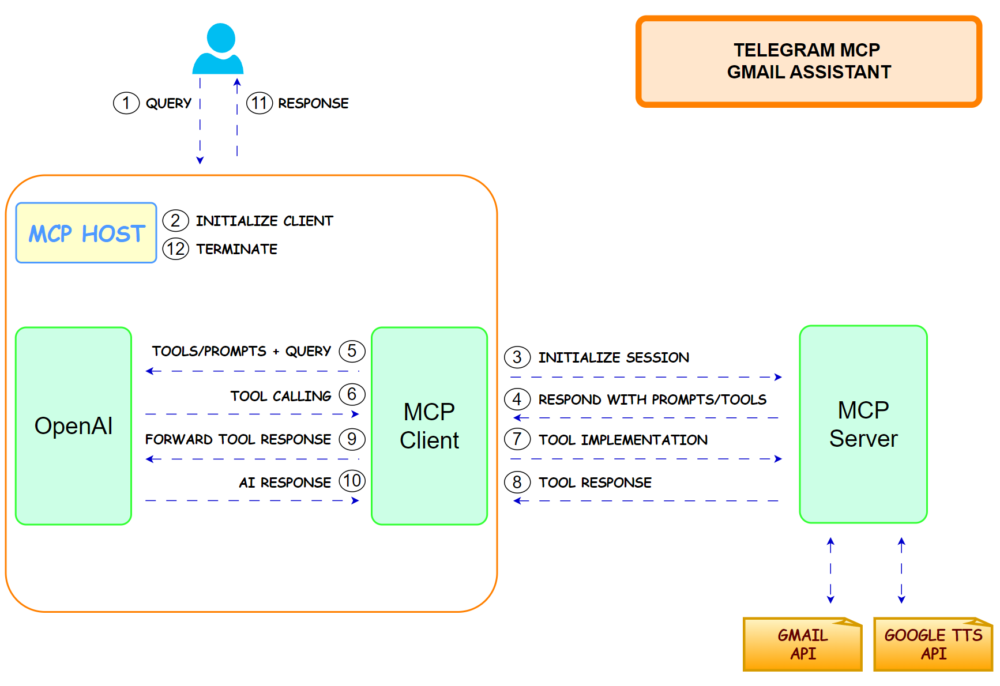

# Gmail Telegram MCP Server



<div align="center">

<!-- Project Status -->

[](https://opensource.org/licenses/MIT)
[](https://www.python.org/downloads/)
[](https://github.com/astral-sh/uv)

<!-- Providers -->

[](https://core.telegram.org/bots)
[](https://console.cloud.google.com/)
[](https://github.com/Model-Context-Protocol)
[](https://platform.openai.com/signup)

</div>

## Table of Contents

- [Gmail Telegram MCP Server](#gmail-telegram-mcp-server)
  - [Table of Contents](#table-of-contents)
  - [Overview](#overview)
  - [Project Structure](#project-structure)
  - [Prerequisites](#prerequisites)
- [Environment Variables](#environment-variables)
  - [Installation](#installation)
  - [Usage](#usage)
    - [Configuration](#configuration)
    - [Google Cloud Project Setup](#google-cloud-project-setup)
    - [Modules](#modules)
    - [Run the Telegram bot](#run-the-telegram-bot)
    - [Testing](#testing)
    - [Quality Checks](#quality-checks)
  - [License](#license)

## Overview

Gmail Telegram MCP Server is a Python project that connects Gmail and Telegram using a Model Context Protocol (MCP) server.

It allows to interact with Gmail emails via a Telegram bot. The following commands are available:

- /start - Start interaction with the bot
- /summary_today - Quick text summary of today's emails
- /audio_today - Quick audio summary of today's emails
- /summary - Smart agent; decides timeframe & format (text/audio/both)

You can read the article about this project in my Substack Newsletter:

- [Article](https://aiechoes.substack.com/p/talk-to-your-inbox-mcp-gmail-bot-819)

## Project Structure

```text
├── Makefile
├── pyproject.toml
├── pre-commit-config.yaml
├── README.md
├── run_bot.py
├── uv.lock
├── src/
│   └── voice_agent/
│       ├── config.py                    # Configuration settings
│       ├── client/                      # Client-side code
│       │   └── agent.py                 # Voice agent client
│       ├── host/
│       │   └── bot.py                   # Telegram bot
│       ├── server/
│       │   ├── gmail_server.py          # Gmail server logic
│       │   ├── prompts/
│       │   │   ├── email_prompts.py     # Email-related prompts
│       │   │   └── prompt_calls.py      # Prompt call definitions
│       │   └── tools/
│       │       ├── get_emails.py        # Email retrieval tool
│       │       └── tts_reply.py         # Text-to-speech tool
│       └── utils/
│           ├── email_parser_util.py     # Email parsing utilities
│           ├── gmail_auth_util.py       # Gmail authentication utilities
│           ├── logger_util.py           # Logging utilities
│           └── openai_utils.py          # OpenAI API utilities
```

## Prerequisites

- Python 3.12
- [uv](https://github.com/astral-sh/uv) (for environment and package management)
- [Google Cloud Project](https://console.cloud.google.com/)
- [Telegram Bot](https://core.telegram.org/bots) with a bot token
- [OpenAI API key](https://platform.openai.com/signup)

# Environment Variables

Create a `.env` file in the root directory with the following variables:

```env
TELEGRAM__BOT_TOKEN=your_bot_token
OPENAI__API_KEY=your_openai_api
OPENAI__MODEL=gpt-4o-mini
GOOGLE__CLIENT_ID=your_client_id
GOOGLE__CLIENT_SECRET=your_client_secret
GOOGLE__APPLICATION_CREDENTIALS=path_to_your_credentials.json
GOOGLE__SCOPES='["https://www.googleapis.com/auth/gmail.readonly"]'
GOOGLE__REDIRECT_URIS='["http://localhost"]'
GOOGLE__AUTH_URI=https://accounts.google.com/o/oauth2/auth
GOOGLE__TOKEN_URI=https://oauth2.googleapis.com/token
```

Additionally, after the first authentication, this token will be generated and added automatically to the `.env` file to make the session persistent:

```env
GOOGLE__GMAIL_TOKEN=your_gmail_token
```

## Installation

1. Clone the repository:

```bash
   git clone git@github.com:benitomartin/gmail-telegram-mcp-server.git
   cd gmail-telegram-mcp-server
```

1. Create a virtual environment:

   ```bash
   uv venv
   ```

1. Activate the virtual environment:

   ```bash
   source .venv/bin/activate
   ```

1. Install the required packages:

   ```bash
   uv sync --all-groups
   ```

1. Create a `.env` file in the root directory:

   ```bash
   cp env.example .env
   ```

## Usage

### Configuration

Configure API keys, model names, and other settings in:

- `src/voice_agent/config.py`
- `.env` file

### Google Cloud Project Setup

1. Create a Google Cloud Project.

1. Enable the Gmail API and Cloud Text-to-Speech API for your project.

1. Under "APIs & Services" > "OAuth consent screen", create your app (external) and configure the necessary scopes.

   1. Add the following scopes (also in the `.env` file):
      - `https://www.googleapis.com/auth/gmail.readonly`

1. Add your email address as an authorized tests user.

1. Create OAuth 2.0 credentials (application type: Desktop App) and copy the client ID and secret to your `.env` file.

1. Run the following command to set the `GOOGLE__APPLICATION_CREDENTIALS` variable. Add the path of the credentials JSON file to the `.env` file. In Linux/Ubuntu is under `/home/user/.config/gcloud/application_default_credentials.json`

   ```bash
   gcloud auth application-default login
   ```

### Modules

- **Voice Agent**: Handles voice interactions and agent logic.
- **Client**: Contains the agent for client-side operations.
- **Host**: Telegram bot integration.
- **Server**: Gmail server logic, prompt management, and tools for email and TTS.
- **Utils**: Utilities for email parsing, Gmail authentication, logging, and OpenAI integration.

### Run the Telegram bot

```bash
uv run run_bot.py
```

### Testing

Run all tests:

```bash
make tests
```

### Quality Checks

Run all quality checks (lint, format, type check, clean):

```bash
make all
```

Individual Commands:

- Display all available commands:

  ```bash
  make help
  ```

- Check code formatting and linting:

  ```bash
  make all-check
  ```

- Fix code formatting and linting:

  ```bash
  make all-fix
  ```

- Clean cache and build files:

  ```bash
  make clean
  ```

## License

This project is licensed under the MIT License - see the [LICENSE](LICENSE) file for details.
